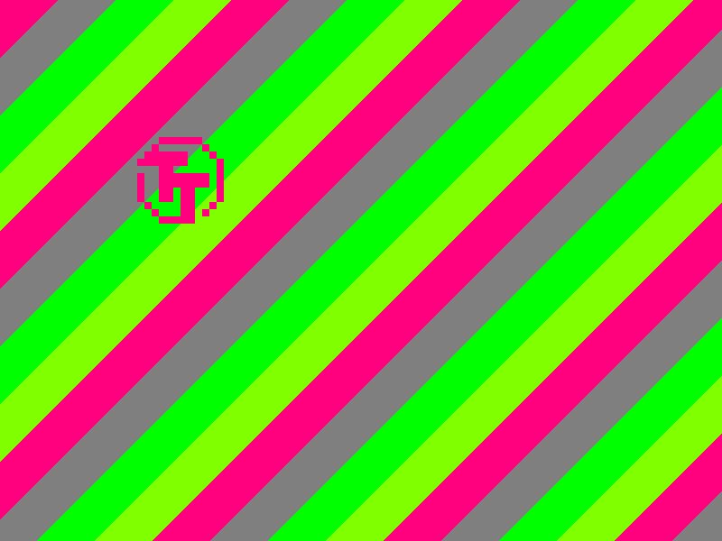
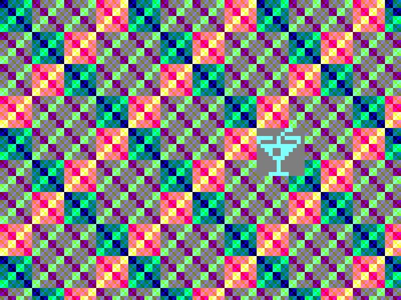
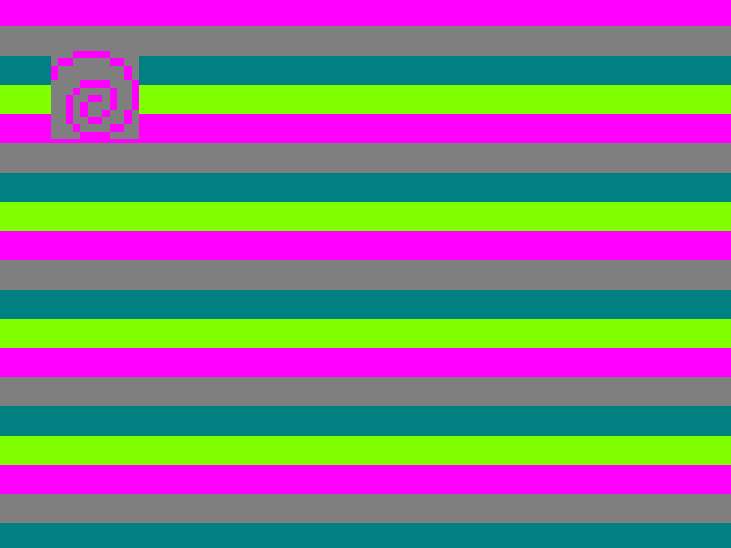
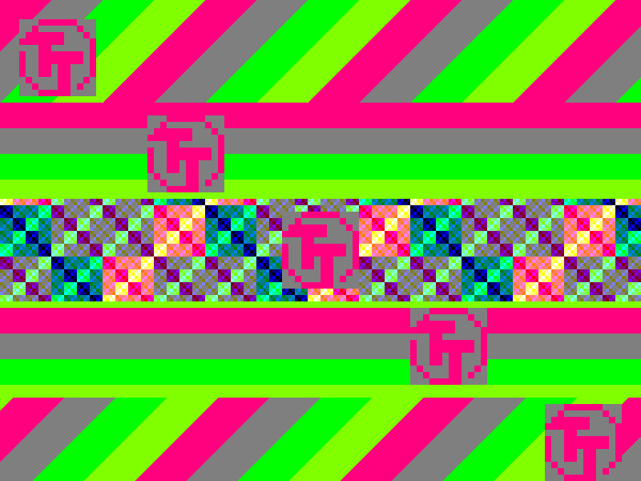
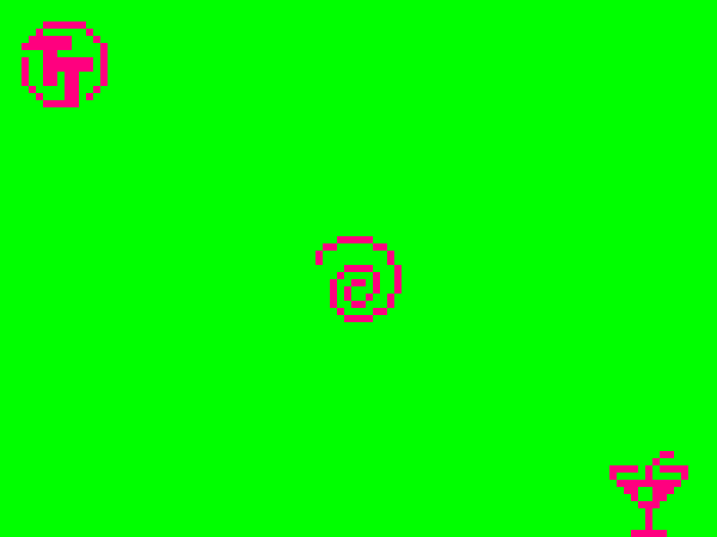

 

# One Sprite Pony

A one-trick pony is someone or something that is good at doing only one thing. Accordingly, a one-sprite pony can display only one sprite, and that's exactly what this design does:


This Verilog design produces SVGA 800x600 60Hz output with a background and one sprite. Internally, the resolution is reduced to 100x75, thus one pixel of the sprite is actually 8x8 pixels.
The design can operate at either a 40 MHz pixel clock or a 10 MHz pixel clock by setting a configuration bit.

The sprite is 12x12 pixel in size and is initialized at startup with a pixelated version of the Tiny Tapeout logo.

An SPI receiver accepts various commands, e.g. to replace the sprite data, change the colors or set the background.

This design targets 1 tile of [Tiny Tapeout 5](https://tinytapeout.com).

The goal is pixel perfect rendering. To achieve this goal, I created a regression test in cocotb, that compares the output image to a software rendering.

## Capabilities

- SVGA 800x600 60Hz output with 2 bits per color (internally reduced to 100x75)
- 40 MHz or 10 MHz operation depending on configuration
- Sprite with 12x12 pixels
	- foreground and background color
	- background can be set transparent
- 4 different colors (6 bit rrggbb)
- 4 different backgrounds
	- Solid color
	- Funky
	- Diagonal stripes
	- Horizontal Stripes
- SPI Receiver
	- Set sprite data
	- Set colors (1-4)
	- Set background (4 types)
	- Set sprite x/y position
	- Set miscellaneous options

|   |   |
|---|---|
|   |   |
|   |   |

## SPI Register

SPI Settings

	CPOL       = 0
	CPHA       = 1
	word width = 8
	MSB first
	CS is active low

Register Map

| Addr Hex | Name | Type | Reset Value | Description |
|----------|------|------|-------------|-------------|
| 0x00     | SPRITE_DATA | R/W | Tiny Tapeout logo | Stores the data for the sprite, you can continuously read/write it by keeping CS asserted |
| 0x01     | COLOR1     | R/W     | 6'b110001            | 6 bit color in format RRGGBB used as sprite foreground            |
| 0x02     | COLOR2     | R/W     | 6'b010101            | 6 bit color in format RRGGBB used as sprite background            |
| 0x03     | COLOR3     | R/W     | 6'b001100            | 6 bit color in format RRGGBB used as solid color background           |
| 0x04     | COLOR4     | R/W     | 6'b101100            | 6 bit color in format RRGGBB            |
| 0x05     | SPRITE_X     | R/W     | 6'b000000            | 6 bit x position of the sprite            |
| 0x06     | SPRITE_Y     | R/W     | 6'b000000            | 6 bit y position of the sprite            |
| 0x07     | MISC     | R/W     | 5'b00110            | Various Settings, see below            |

Details for MISC Register:

- Bits 1:0: Background selection
	- 00: Solid color
	- 01: Funky
	- 10: Diagonal Stripes
	- 11: Horizontal Stripes

	New background type is assigned at hsync to prevent glitching
- Bit 2: Enable movement of the sprite
- Bit 3: Enable sprite background (transparency)
- Bit 4: Enable reduced frequency mode (10 MHz operation)
	This option is assigned at a new frame to prevent glitching

Backgrounds:

- Background type 1 uses COLOR3 as solid color.
- Background type 2 calculates the color based on the screen coordinates.
- Background types 3 to 4 (stripes) use all four colors for the stripes.

For background types 2 to 4, the current time is used to vary the background.

**Attention**

Reading and writing SPI registers must always be done in 8 bits even if the register uses less bits. The exception is when sending the sprite data, there you can bits for as long as CS is asserted.

When writing registers with less than 8 bits, the lower bits will be used. e.g. you want to set a color with 6 bits to 110001, just prepend two more bits: 00110001.

When reading registers with less than 8 bits, e.g. for a color with 6 bits the last 2 bits that are read will be the first two bits shifted in. This means you need to shift the received data by >>2 before using it.

## Creating Your Own sprites

A small Python script reads the sprites under `sprites/` and displays the data ready to be used for both Verilog and Python.

Just run `make sprites` to generate the sprite data from the images.

The sprite data format is defined as follows:

```
          First bit
              |
	000111111000 - Line 0
	001000000100 - Line 1
	010001111110 - Line 2
	100001111111 - Line 3
	100000011000 - Line 4
	101111111001 - Line 5
	101111111001 - Line 6
	100011011001 - Line 7
	100011011001 - Line 8
	010011000010 - Line 9
	001011000100 - Line 10
	000011111000 - Line 11
   |
Last bit
```

You can directly see from the bit data the shape of the sprite, note that the sprite is mirrored at the Y-axis.

When writing new sprite data via SPI you must start with the first bit until the last as described above.

## Creating an Animation

Run the verilator simulation via `make sim-verilator`. The folder `images` will be populated with the individual frames.

You can then use imagemagicks `convert` to create a gif via: `make animation.gif`

## Verification

To run the regression tests, use `make sim-cocotb`. The resulting images can be found under `sim_build`.

## FPGA Prototyping

An FPGA design has been created for the ULX3S. There is also one for the icebreaker, but unfortunately it does not match the timing.

Just run `make upload-ulx3s` to create the bitstream and upload it to the flash of the ULX3S.

## Tips and Tricks

### Displaying multiple Sprites

Just because One Sprite Pony contains only sprite doesn't mean it can't display more than one.

By using scanline-tricks it is able to display the same sprite multiple times and change background types:



If you are fast enough, you can even swap the sprite in between:



Just write to the various registers while the frame is drawn.

I am excited what you are going to do with it!

## Different Applications?

With some imagination One Sprite Pony can become so much more:

1. ROM for TT Sprite (just read out the sprite data)

2. RAM (read and write sprite data and registers)

3. hand warmer? (the design has a density of ~90%, but since all other designs are disabled at the same time, the chip will probably not warm up ;) )
